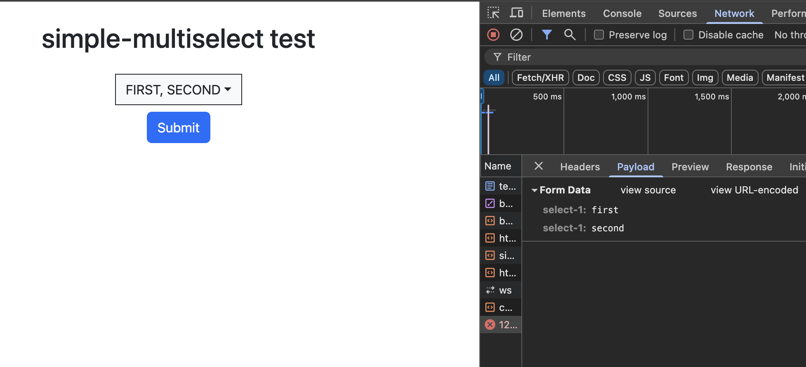

# simple-multiselect

`simple-multiselect` is a simple script for creating multiple options select inputs designed to work with `Bootstrap`.

## how to get

```html
<script src="https://cdn.jsdelivr.net/gh/gavril-s/simple-multiselect@latest/simple-multiselect.js"></script>
```

## examples

This form:

```html
<form hx-post="/" class="mt-4">
    <select id="select-1" multiple name="select-1" onreplace="log(evt);">
        <option value="first">FIRST</option>
        <option value="second">SECOND</option>
        <option value="third">THIRD</option>
    </select>
    <button type="submit" class="btn btn-primary mt-2">Submit</button>
</form>
```

gives you this multiselect element:

https://github.com/user-attachments/assets/7339a046-7c7b-478c-802e-f35b76dee7a2

When submited, it produces the same result, as the original form would:


